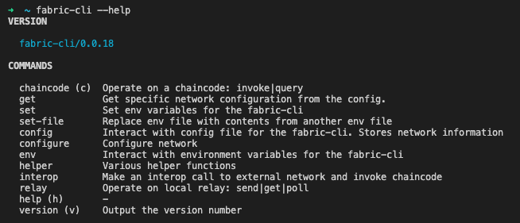

# fabric-cli 

A CLI for interacting with the fabric test-net and relays. Made using [gluegun.js](https://infinitered.github.io/gluegun/#/)

fabric-cli options: 



--help can be called on every command and provides examples and usage. 

More documentation can be found [here](docs/commands.md)

# Folder Structure 
    .
    ├── build                      # Compiled files 
    ├── docs                       # Documentation files 
    ├── src                        # Source files
    │   ├── commands               # Commands for the cli. Subcommands are in named folders
    │   ├── data                   # Data used across the commands, includes credentials for other networks and basic data to initialise the network with
    │    ├── helpers                # Helper functions that are used across the commands
    │   └── wallet-${networkname}  # Wallets used by the CLI to connect with the fabric networks. 
    └── ...

Another naming convention made is inside the commands folder files suffixed with "`-helper`" are used to for the `--help` options for each command. 

# Installation

The tool can be installed via npm or manually. If no development is required it is recommended to install via npm. 

## Installing with npm

Set up `.npmrc` by copying across the `.npmrc.template` and updating the values. View [Setup Artifactory token for fabric-interop-sdk for the detailed process](https://github.ibm.com/dlt-interoperability/network-setups/tree/master/fabric/dev/scripts/fabric-cli#setup-artifactory-token-for-fabric-interop-sdk)

Add contents of the `.npmrc` to the `.npmrc` located at `~/.npmrc`, be careful not to replace anything

then run `npm install -g @res-dlt-interop/fabric-cli`

NOTE: If installing this way it is required to set up the env and config through the cli using either `fabric-cli env set <key> <value>` or `fabric-cli env set-file <file-path>`. Refer to the `.env.template` and `config.json `to determine what values are needed. 

## Installing manually

### Pre-req


NOTE: If you are using a linux system make sure that `lib64` is installed

Tested on Node v10.16.3 requires Node >= 10.15.3 < 13.0

Set up `.env` by copying across the `.env.template` and updating the values

Set up `config.json` by adding the connection profile and relay port for each network. (Can be set with env variable `CONFIG_PATH`)

(Editing of the env and config can be done via the CLI with the `fabric-cli env set` and `fabric-cli config set` commands)

Set up `.npmrc` by copying across the `.npmrc.template` and updating the values. View [Setup Artifactory token for fabric-interop-sdk for the detailed process](https://github.ibm.com/dlt-interoperability/network-setups/tree/master/fabric/dev/scripts/fabric-cli#setup-artifactory-token-for-fabric-interop-sdk)

Have `yarn` installed and have Node >= 10.15.3 < 13.0

Run `yarn` to install dependencies. 

### Development

`cd fabric-cli`

and

`yarn link`

Then run 

`$ fabric-cli`

## Docker

Set up `.npmrc` by copying across the `.npmrc.template` and updating the values. View [Setup Artifactory token for fabric-interop-sdk for the detailed process](https://github.ibm.com/dlt-interoperability/network-setups/tree/master/fabric/dev/scripts/fabric-cli#setup-artifactory-token-for-fabric-interop-sdk)

Run `make build-image` to build fabric-cli docker image.

Then run `docker-compose up -d` to start fabric-cli container.

Then run `docker exec -it fabric-cli bash`, to open interactive shell for fabric-cli, where regular fabric-cli calls can be made.

Setting env is not required inside docker, as env variables are already declared, so next steps would be:
* `fabric-cli config set-file $CONFG_PATH`
* `fabric-cli configure all network1 network2`.


## Example Invoke 

To record a key `test` with the value `teststate` via the `simplestate` contract deployed on the `mychannel` channel in `network1`, run:
```
$ fabric-cli chaincode invoke mychannel simplestate create '["test", "teststate"]'` --local-network=network1
```
To now query the value of the the `test` key, run:
```
$ fabric-cli chaincode query mychannel simplestate read '["test"]' --local-network=network1
```

NOTE: Use the `--help` flag with any command to view examples and usage.

## Publishing CLI 

Run `npm publish` will error if same version is already published. Will need the artifactory token, will error if same version is already published. Will need the artifactory token.

## Setup Artifactory token for fabric-interop-sdk

1) Go to IBM artifactory (https://na.artifactory.swg-devops.com/artifactory/)
2) Click on your email id on top right
3) Generate/Copy the API key from profile, let's say it is - "ThisIsMyAPIKey"
4) Run this command on your system - 
	 curl --header 'X-JFrog-Art-Api: ThisIsMyAPIKey' https://na.artifactory.swg-devops.com/artifactory/api/npm/auth
5) The above command will return you auth token along with auth settings and your email id from artifactory.
6) Create a .npmrc file in the backend folder (from where you want to run npm install)
7) Add this line to your .npmrc file,
	 @res-dlt-interop:registry=https://na.artifactory.swg-devops.com/artifactory/api/npm/res-dlt-interop-npm-local/
8) Add the output of curl to that file.
9) Final .npmrc should look like this - 
   "@res-dlt-interop:registry=https://na.artifactory.swg-devops.com/artifactory/api/npm/res-dlt-interop-npm-local/
    _auth = <Auth-token>
    always-auth = true
    email = user@email.com"
10) Run npm install to check if artifactory connection is working before testing/deployment.

## Environment Variables
- `DEFAULT_CHANNEL` (OPTIONAL) The default channel used by the CLI when invoking chaincode on a network. 
- `DEFAULT_CHAINCODE`(OPTIONAL) The default chaincode id used by the CLI when invoking chaincode on a network. 
- `MEMBER_CREDENTIAL_FOLDER`(OPTIONAL) The folder where network configurations will be stored and pulled from when generating network config and loading the chaincode. 
- `CONFIG_PATH`(OPTIONAL) Path to the configuration file used by the CLI when creating network credentials and communicating with the relays. 

## Configuration file (required)

The configuration file is used by the CLI when generating credentials to communicate with the network as well as the endpoint used to communicate with the relay. Each network can specify a unique relay and connection profile. 

Example config:
```
{
  "network1": {
    "connProfilePath": "",
    "relayEndpoint": ""
  },
  "network2": {
    "connProfilePath": "",
    "relayEndpoint": ""
  }
}
```

## NOTE

Due to how fabric works and the CA works once a wallet has been created with identities in the CA you can not create new wallet without fist revoking the original credentials. This can have some issues if you have deleted a wallet and are trying to recreate one.


# License

MIT - see LICENSE

